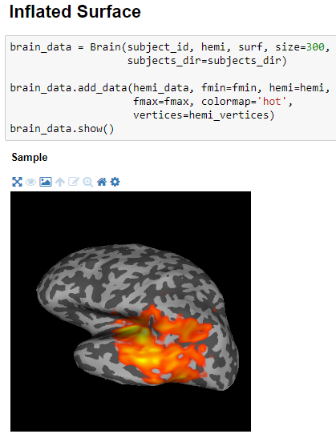

# Ipysurfer

[](https://mybinder.org/v2/gh/mne-tools/mne-gsoc2018-3d/master?filepath=examples%2Fbrain-mesh.ipynb)

This project enables interactive 3D visualization of human brain activity inside Jupyter Notebook.
It can be regarded as an alternative to `mayavi` and `PySurfer`-based human brain visualization, built on top of `ipyvolume` and `ipywidgets`.



For a quick demonstration of `ipysurfer`, see [this Binder demo](https://mybinder.org/v2/gh/mne-tools/mne-gsoc2018-3d/master?filepath=examples%2Fbrain-mesh.ipynb).

## Requirements

- [bqplot](https://github.com/bloomberg/bqplot)
- [ipyvolume](https://github.com/maartenbreddels/ipyvolume)
- [Matplotlib](http://matplotlib.org)
- [mne](https://github.com/mne-tools/mne-python)
- [nibabel](https://github.com/nipy/nibabel/)
- [NumPy](https://github.com/numpy/numpy)
- [pythreejs](https://github.com/jupyter-widgets/pythreejs)
- [SciPy](https://github.com/scipy/scipy)

## Installation

`ipysurfer` depends on the development branch of a few projects. To install, follow these steps:

1. Clone the repository
   
   ```
   git clone https://github.com/mne-tools/mne-gsoc2018-3d
   cd mne-gsoc2018-3d
   ```
2. Install the required dependencies in a new environment using "anaconda" and the provided `environmnent.yml` file.

   ```
   conda env create -f environment.yml
   ```
   
   Alternatively, inspect this file and install dependencies on your own. Note that some must be installed from a development
   branch of the package (`ipyvolume`).
3. Install `ipysurfer`:
   
   ```
   pip install -e.
   ```
